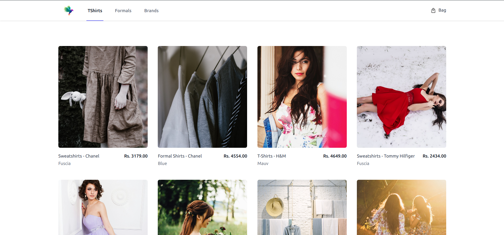
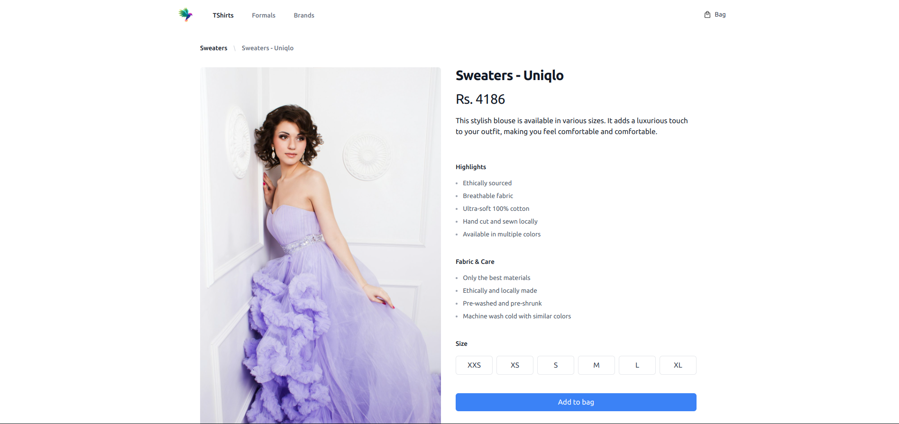

# Ecommerce Application

This is a simple ecommerce application built with a reactive Spring Boot backend and a React frontend. The project is
structured with separate directories for the backend and frontend. Docker Compose is used to manage the services,
including a PostgreSQL database and pgAdmin for database management.

## Prerequisites

- Docker
- Docker Compose

## Services

- **ecommerce-service**: The backend service built with Spring Boot.
- **postgres**: The PostgreSQL database service.
- **pgadmin**: The pgAdmin service for managing the PostgreSQL database.

## Environment Variables

- `DB_USER`: Database username (default: `ecomm_user`)
- `DB_PASSWORD`: Database password (default: `uKiTgHCM&51`)
- `POSTGRES_DB`: Database name (default: `ecommerce`)
- `POSTGRES_USER`: PostgreSQL username (default: `ecomm_user`)
- `POSTGRES_PASSWORD`: PostgreSQL password (default: `uKiTgHCM&51`)
- `PGADMIN_DEFAULT_EMAIL`: pgAdmin login email (default: `admin@admin.com`)
- `PGADMIN_DEFAULT_PASSWORD`: pgAdmin login password (default: `password`)

## Running the Application

### Backend

1. **Build the Docker Image**:
   Navigate to the `backend` directory and build the Docker image:
    ```sh
    cd backend
    mvn install
    docker build -t ecommerce-service .
    ```

2. **Start Services**:
   Navigate back to the root directory and start all services using Docker Compose:
    ```sh
    cd ..
    docker-compose up -d
    ```

### Frontend

1. **Install Dependencies**:
   Navigate to the `frontend` directory and install the required dependencies:
    ```sh
    cd frontend
    npm install
    ```

2. **Start the Frontend Development Server**:
   Start the React development server:
    ```sh
    npm start
    ```

   The frontend will be accessible at `http://localhost:3000`.

## Accessing pgAdmin

pgAdmin can be accessed at `http://localhost:5050`. Use the credentials specified in the environment variables to log in:
- Email: `admin@admin.com`
- Password: `password`

## Stopping the Services

To stop all running services, use the following command:
```sh
docker-compose down
```

## Screenshot



